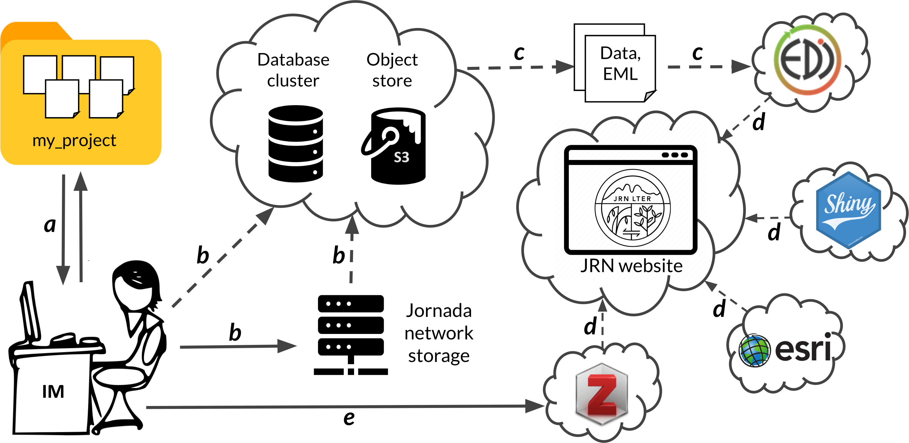
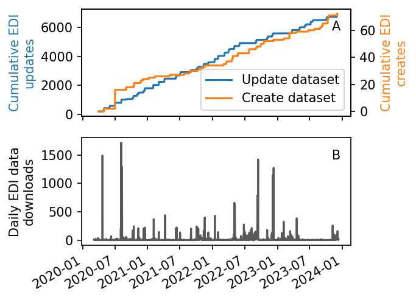

# Data Management Plan for JRN LTER-8

version 0.4

## Introduction

The Jornada Basin LTER program (JRN) supports an effective and well-integrated information management (IM) program and shares the LTER Network view that published datasets are first-class products of research and an opportunity for outreach and education. The JRN Information Management (IM) system reliably performs a full range of essential data management functions to make research data and other information produced by the JRN program findable, accessible, interoperable, and re-usable (FAIR, Wilkinson et al. 2016). The team that designs and operates this system is guided by three core priorities.

1. Contribute to high quality, impactful ecology research at all stages of the data life cycle
2. Oversee, or directly handle, publication of all Jornada datasets
3. Act as a source of data-related leadership, education, and outreach

The JRN IM team approaches each of these priorities with a philosophy of openness to diverse stakeholders, including scientists, resource managers, students, & the public, and a commitment to the principles of open scientific research. In this Data Management Plan, we review recent progress in JRN IM, and outline the strategy for managing and publishing JRN research data from 2025 to 2030.

## IM resources

__Personnel__: The IM team is headed by Dr. Gregory Maurer, supported at 0.5 FTE by JRN. He leads a team comprised of part-time computer programmer Dr. Geovany Ramirez, full-time site and long-term data manager John Anderson, and part-time undergraduate assistant Gillian Trujillo. The JRN IM group collaborates closely with USDA data managers, including statistician Darren James. Program coordinator Madeleine Soss shares responsibility for JRN website content and communication with all personnel. USDA staff Scott Schrader and Ken Ramsey assist with managing local infrastructure and network resources. Maurer meets at least monthly with the JRN leadership team to align IM activities with research priorities, convey updates, and take feedback on data management standards and procedures.

__Computing and storage infrastructure__: The JRN IM system is built on multiple technologies and infrastructure resources that provide secure, resilient computing and storage capabilities for JRN personnel, external collaborators, and the public. Most members of the JRN IM team have offices in Wooton Hall, headquarters of the USDA-ARS Jornada Experimental Range (JER), on New Mexico State University (NMSU) campus. A long-standing ARS-LTER agreement allows the JER to provide and manage some of the computing infrastructure that JRN requires (Table 1), including a server cluster with a 100TB storage block from which JRN staff are provided with networked file storage shares. Research data, IM-related metadata and tools, and staff files and documents (e.g., images, equipment manuals, procedures documents) are stored on these shares. Most other JRN IM infrastructure has transitioned to cloud-based systems in the last four years (Table 1) to reduce physical infrastructure maintenance demands and increase reliability and uptime. Linux virtual machines and S3-compatible object stores at _DigitalOcean.com_ host databases with research metadata and other information (PostgreSQL 12), web-accessible storage for data entities, and full offsite backups of local Jornada file storage. The JRN website is built with _WordPress_ and has several associated Javascript data catalog and bibliography applications, all of which are hosted at _WPengine.com_. Data catalogs and bibliography apps rely on API access to data stores at the Environmental Data Initiative (EDI) repository, _Zotero.org_, and NMSU's _ArcGIS Online_ instance. The USDA-ARS provides access to a _Shinyapps.io_ account for developing and hosting _R Shiny_ applications like the JRN website's interactive data viewer. All cloud-based systems have a minimum of nightly backups with distributed storage and rollback ability. The JRN IM team backs up all shared local files nightly to an in-house device and the DigitalOcean S3 bucket, which is in addition to weekly, off-site tape-drive backups of the same data performed by USDA-ARS staff. Technology transfers update hardware, software, and file formats on a 3-5 year cycle to ensure long-term data protection against media or format obsolescence. Depending on project needs and institutional requirements, the IM team and researchers use a variety of secure cloud platforms (e.g. Trello, GitHub, Dropbox or Google Drive) for online collaboration and storage of documentation, code, and other project information.

**Implemented service** | **Local/remote infrastructure** | **Software** 
:------------------ | :--------------------  | :---------------------------------------------
Networked file storage on NMSU campus | 100TB local storage block | CIFS
_LTER-core-metabase_ metadata database | DigitalOcean.com VM | Ubuntu Linux 20.04, PostgreSQL 12.16
Web-accessible data storage, offsite backups | DigitalOcean.com Spaces | S3-compatible object store
JRN website and associated app hosting | WPengine.com | Wordpress 6
EDI data catalog app (JRN website) | portal.edirepository.org | PASTA+ API, Javascript
Bibliography, non-EDI data catalog apps (JRN website) | Zotero.org | Zotero API, Javascript
Interactive data viewer (JRN website) | Shinyapps.io | R Shiny (Javascript app builder)
Document storage/sharing for remote collaboration | Dropbox, Google Drive, GitHub

Table 1: The information technology services used by JRN, along with the associated local or remote infrastructure and softwares responsible for implementing them.

__Network infrastructure__: Servers and staff computers at Wooton Hall are connected to a Gigabit local area network (LAN) linked to the NMSU network (Gigabit Ethernet) through a firewall. Local networked systems and web applications are password-protected, and regular security sweeps identify security threats. The USDA Jornada field headquarters (HQ; centrally located at the LTER research site) is linked to the NMSU network via a 40 MB multi-hop, point-to-point wireless backhaul connection that can accommodate large-volume data. Field instruments are connected via spread spectrum wireless radios to base stations and the internet at HQ. Wireless internet at HQ is available for JRN LTER use.

## Data management practices

 Jornada data management practices must accommodate diverse research activities and data products, ranging from tabular field data, to ground-based and airborne imagery, to ecological model outputs, to data from specimen and sample collections. The JRN IM system therefore uses several infrastructure components and procedures to create, manage, and distribute research data and other information in a modular way. Wherever possible the JRN IM team uses open-source tools and community standards. All documentation for the system is available in the group's public _GitHub_ organization (<https://github.com/jornada-im>), along with instructional materials for data-related education and outreach. Essential functions that the IM system delivers, with relevant components and processes, are described below. Stages of the DataONE data life cycle are identified in parentheses after section headings.

![Figure 1: A simplified schematic of the JRN Information Management system. Handling of a contributed JRN research dataset is depicted on the left, with infrastructure components (local and cloud-based) to the right. Labeled arrows depict data management processes, including a) the dataset submission, review, and revision process between IMs and researchers, b) data entry and backup to local and cloud infrastructure, c) dataset publication to EDI, d) cloud platform (EDI, shinyapps.io, ArcGIS Online, Zotero.org) API service calls updating the JRN website, and e) data and application updates to cloud platform services. Dashed arrows involve scripting and automation. Image credit xkcd.com.](./img/JRN_IM_schematic_2024_up.png){width="900px"}

<figure>
  
  <figcaption><em>Figure 1: A simplified schematic of the JRN Information Management system. A research dataset contributed to the IM team is depicted on the left, with infrastructure components (local and cloud-based) to the right. Labeled arrows represent data management processes, including a) dataset submission, review, and revision in coordination with researchers, b) data entry and backup to local and cloud infrastructure, c) dataset publication to EDI, d) cloud platform (EDI, shinyapps.io, ArcGIS Online, Zotero.org) API service calls updating the JRN website, and e) data and application updates to cloud platform services. All dashed arrows involve some scripting and automation. Image credit xkcd.com.</em></figcaption>
</figure>  

__Data collection and quality assurance (Collect, Assure)__: The IM team carefully tracks the status of Jornada research projects to ensure that collected data receive thorough quality checks before being published. Most data products from JRN projects are tabular in nature, and there are three primary entry points for this data into the JRN IM system: (1) collection of long-term datasets by the 3-person JRN field crew and site manager Anderson, (2) autonomous data collection by sensor networks and dataloggers, and (3) data submission by LTER investigators, students, and collaborators. For data entry point (1), field data collection schedules vary depending on the project, and site manager Anderson is responsible for archiving raw files and managing data entry/transcription and validation procedures. Anderson works closely with the rest of the IM team to quality assure and check (QA/QC) new data and produce files suitable for publication on an annual basis. To optimize efficiency, the IM team has developed custom workflows (in _R_, _Python_, _Matlab_, or _Excel_) to assist with QA/QC and generate output files. For entry point (2) we use the _MATLAB GCE Toolbox_ (developed at GCE LTER) for data QA/QC, and have extended its functionality to allow rapid data flagging and publication to EDI using software developed by Ramirez and Anderson. For entry point (3), students and investigators QA/QC their own data and submit it with appropriate metadata to the IM team on a timeframe matching JRN and LTER data access policies (see below). Once data and metadata are submitted to the IM team, an additional layer of QA/QC and standardization is applied through database validation and custom R scripts (Fig. 1) during the data publication phase.

There are several classes of specialized JRN data products, including large datasets and non-tabular formats, that require a flexible approach to quality assurance. Biological specimens and physical samples destined for scientific collections are not assessed or otherwise handled directly by the IM team. Sequencing and genomic research generates datasets that are best assessed by those trained in bioinformatics. JRN modeling activities generate rapidly evolving code and parameter sets, and voluminous output/simulation data. Similarly, large collections of ground-based or airborne imagery are generated by multiple JRN research efforts. In each of these cases the JRN IM team has limited capacity to directly QA/QC the data. Instead, the focus is on training and coordination with the responsible researchers to ensure data quality and security, and collection of appropriate, descriptive metadata.

__Data packaging and publishing (Describe, Preserve)__: To meet the FAIR data criteria, JRN strives to publish quality-assured data accompanied by rich, detailed metadata. Creating and publishing new datasets begins with submission of metadata using EDI's _ezEML_ tool, or a metadata template created by the IM team (_MS Word_ or _Excel_ formats). The IM team consults closely with researchers, students, and staff to determine what constitutes a useful dataset and how to describe one with metadata. Upon submission, the IM team stores and manages metadata for all tabular data products in a relational database following the _LTER-core-metabase_ schema (_metabase_ hereafter) which is maintained by a working group of the LTER Network Information Management Committee (IMC). This system validates and enforces standards, such as use of the LTER Controlled Vocabulary and Standard Units Dictionary, for incoming metadata. JRN also uses its own set of metadata standards and controlled vocabularies developed in consultation with Jornada researchers.

The JRN IM team publishes datasets in community-accepted online data repositories, with most going to the EDI data repository, which is closely affiliated with the LTER Network and focuses on metadata standards and data re-use. Before publication, the IM team error-checks and formats data files for usability, then uses an _R_-based workflow (_MetaEgress_ and _jerald_ packages) to extract metadata from _metabase_ and generate an XML file formatted to the Ecological Metadata Language (EML) 2.2 standard. Data and EML files are then published together in EDI's Provenance Aware Synthesis Tracking Architecture system (_PASTA+_). The consistency and integrity of all data and metadata is checked again by the _PASTA+_ system upon entering the repository. Datasets held at EDI constitute the primary JRN data catalog (Fig. 1), but some JRN data products are published elsewhere.

Specialized data products often have unique, community-standard data formats and metadata, and may benefit from alternative repository systems and publication methods. The IM team encourages and facilitates publication to non-EDI data repositories when logical to do so, and there are significant JRN data holdings in NCBI databases (sequencing and genomic data), AmeriFlux (flux towers), and the Phenocam network. Citation metadata for products in these repositories are entered into a Zotero library and listed in JRN's non-EDI data catalog. In JRN-8 the IM team will begin placing new high-volume datasets (UAS imagery, acoustic monitoring data, model training data) into offline storage and making metadata records available in EDI. In all these cases the JRN IM team prioritizes providing high-quality metadata to allow others to discover the data, wherever it may reside, and assess its quality and fitness for use.

For specimens and samples collected during JRN research, the IM team collaborates with investigators to identify suitable partner museums or natural history collections, assemble appropriate metadata, and then accession the physical items into the collection, and metadata into an accessible database (e.g. _Arctos_, _Symbiota_). Plant and vertebrate voucher specimens are currently sent to the NMSU Herbaria and NMSU Wildlife Museums, respectively, and less-frequently collected specimens, like invertebrates, have been accessioned into a range of other collections in the past. Decades of Jornada soil survey and pedology samples have been archived at the NRCS National Soil Archive. When accessioning specimens and samples into established collections is not possible, the JRN IM team ensures stable local storage, catalogs all appropriate metadata, and makes the collection accessible on the JRN website. Some physical samples, including aeolian dust, atmospheric deposition, and plant tissue samples, are already handled this way. In recent years at JRN, environmental samples like soils, biocrusts, tissues, fecal pellets, and DNA extracts are being collected for metabarcoding, metagenomics, and other sequencing-based methods of investigation. Most of these are currently archived in investigator or departmental laboratory facilities (-80 freezers). In JRN-8, the IM team is proposing new protocols to handle these samples and associated data; see item 4 under "Future initiatives" below.

{width="400px"}

<figure>
  
  <figcaption><em>Figure 2: A plot of JRN’s PASTA+ database activity (knb-lter-jrn scope) at the EDI repository since the 2020 JRN-8 proposal submission. Panel A: Cumulative dataset creation and update events. Panel B: Daily data downloads for JRN datasets. Known robots have been removed. </em></figcaption>
</figure>  

__Data archiving and access policies (Preserve, Discover)__: In adherence with the Type I data guidelines described in the LTER Network Data Access Policy, JRN strives to publish all research data no more than 2 years after collection or at the time of journal article publication. Long-term core research datasets are prioritized highest for publication within this 2 year period, while student thesis data receive lower publication priority as students finish, and datasets from early, previously unpublished JRN studies are published as time allows. To ensure compliance with this policy, JRN strongly encourages timely submission and archiving of research data from all supported projects. Investigators and students, particularly those receiving JRN graduate fellowships or other funds, are required to submit data to the IM team within a year of research project initiation, and annually thereafter for long-term research. The IM team regularly communicates these requirements directly to PIs and students at JRN meetings and training events. At present, no Type II data are collected at JRN.

Data published in the primary JRN data catalog are publicly accessible in three locations: the JRN website, EDI, and the DataONE metadata aggregator through EDI's membership. Almost all JRN datasets are published with the Creative Commons "CCBY" or "CC0" license, with minor exceptions for JRN data published in non-EDI repositories (e.g. NCBI). Detailed spatial data for research sites and instrumentation in areas accessible to the public (JER and the Chihuahuan Desert Rangeland Research Center) are withheld from public metadata but are available to researchers upon request.

__The JRN website (Plan, Discover)__: The JRN website (<https://lter.jornada.nmsu.edu>) is the central means of exposing all aspects of research, education, and outreach activities in an accessible and user-friendly way. It conveys this information through a mix of static and interactive pages featuring site and program descriptions, blog posts, maps, research vignettes, and other materials. Website information is updated regularly and designed for effective communication with JRN scientists, staff, external collaborators, and the public. 

The JRN website has two main data-related functions. First, it directly communicates important information about collecting and sharing data to JRN researchers and staff. The "For Researchers" menu covers important topics such as (a) procedures for initiating new research, (b) site and field safety information, (c) conduct and inclusive research expectations, (d) incident reporting, and (e) expectations and procedures for contributing Jornada data, specimens, and samples. The IM team ensures that this content is accessible, clear, and actionable. Second, the website is the gateway for discovery and access to JRN data. The website data catalog is multi-faceted and includes capable browsing and search tools. The primary website data catalog queries the EDI repository using the _PASTA+_ API and returns results that link directly to dataset landing pages on EDI, meaning that the data catalog always reflects current JRN holdings on EDI. Other facets of the data catalog allow discovery of non-EDI datasets, spatial data, biological specimens and physical samples, and data available from JRN's non-LTER research partners.

Access to JRN publication and personnel listings is provided via website applications as well. For publications, an LTER-community maintained javascript application provides access to a _Zotero.org_-backed JRN bibliography of peer-reviewed journal articles, book chapters, reports, and theses. Current JRN personnel are featured on the website using a _WordPress_ plugin, which the IM team populates from an extensive personnel database that reaches back to the beginning of the program.

## Additional IM activities

__IM integration with research (Plan, Describe, Integrate, Analyze)__: The IM team is composed of experienced ecologists, statisticians, and computer scientists (and students in these fields) who contribute to JRN research in a range of scientific capacities. They work closely with Jornada investigators to ensure that research projects are soundly designed, address high-priority JRN research objectives, and meet all open science and data management standards and obligations. For new research, IM involvement typically begins early in the project approval process or during proposal writing efforts, allowing IMs to consider any unique data demands and initiate sound data management procedures. The IM team regularly contributes to research using JRN’s long-term core datasets, and therefore has a valuable perspective for overseeing these important projects. Recently, for example, the IM team led an effort to evaluate JRN’s long-term plant phenology data and revise the observation program to match National Phenology Network and NEON protocols (Elmendorf et al. 2016). Members of the IM team also manage their own research projects, advise JRN students and investigators, and contribute to journal articles.

__Education and outreach__: The JRN IM team prioritizes data-related leadership, education, and outreach by promoting the importance of Jornada data and sound data management practices, and building the data literacy and skills of Jornada investigators, students, and staff. Maurer and James are certified Carpentries instructors and have organized five scientific programming and data analysis workshops in the past 3 years. At the annual _Jornada Desert Ecology Short Course_, the IM team delivers a detailed Jornada Information Management presentation to students and researchers, and organizes ad-hoc events such as Data Jams (with Asombro), metadata clinics, or Carpentries workshops. Maurer holds weekly data-related office hours (Data Therapy Thursday) and James holds a monthly _R_ work group.

__Network participation__: Members of the JRN IM team actively contribute to the LTER Network's IM activities in several capacities. From 2020-2023, Maurer served on the IM Executive committee for the network, including a term as co-chair, and he currently leads or participates in several EDI/LTER working groups. JRN contributes code, data, and expertise to several EDI and LTER data synthesis projects and collaborates closely with IMs from SEV, MCM, and NWT to organize education and outreach activities.

## Recent accomplishments and future initiatives

__Milestones in the current funding cycle__: Since its last LTER renewal in 2020, JRN has developed a more efficient data publishing system, eased discovery and access of its diverse datasets, and enhanced data reusability by standardizing data and metadata. Milestones from the past four years include:

1. A total of 386 JRN datasets are published at the EDI repository, with 72 newly created since the renewal, including many previously unpublished datasets from early JRN LTER projects. More than 300 datasets had data and/or metadata updated at least once in this period, with most long-term core datasets being updated yearly, and as frequently as monthly for over 30 weather station datasets (Fig. 2).
2. We created _metabase_ and populated it with the rich metadata Jornada research programs have accumulated over the past 40 years. This system eased implementation of new data formatting and metadata content standards for almost all datasets in the JRN data catalog.
3. New standards and workflows to manage and publish specialized (non-tabular) datasets, such as ground-based and airborne imagery, were developed in collaboration with data managers in the LTER network and beyond (Gries et al. 2021).
4. The JRN data catalog was revised to enhance discovery and access to: (a) data published outside of EDI, (b) geospatial data, and (c), data from collaborating research networks and partners.

__Future initiatives__: The IM team will continue making steady improvements to the JRN IM system and the quality and FAIR status of JRN data. The next six years will bring significant changes to JRN research priorities and data, and the IM team plans to support these transitions. Planned improvements during JRN-8 are:

1. The IM team will expand its focus on the re-use of JRN data by harmonizing datasets, creating analysis-ready data products, and developing analytical applications. We will use open-source tools like R and Python, and leverage recent improvements in JRN metadata standards and publishing efficiency.
2. JRN research projects continue to expand data collection via sensor networks. The IM team will extend the use of the _MATLAB GCE Toolbox_ by implementing a new time series database for these data, and open-source tools to manage, publish, and access them efficiently. A pilot project for this began in 2023 in coordination with the HyMet working group, a joint effort of the LTER Network, EDI, CUAHSI, and the Dendra project. A side benefit of this work will be accessibility of real-time information about field conditions that will improve researcher safety.
3. Several JRN-8 projects propose to collect and use ground-based and aerial imagery (e.g. phenocams, UAS imagery) as a survey and monitoring method to complement or replace manual fieldwork. The IM team will respond with a suitable set of data management protocols and accessibility tools.
4. As noted above, biological specimens and physical samples are a key product of JRN research. In JRN-8, the IM team will work to (a) identify JRN physical sample and specimen collections and make a comprehensive catalog accessible via the JRN website, and (b) develop new protocols to preserve and archive scientifically useful environmental samples (soil, biocrust, tissues), or resulting DNA extracts, into appropriate collections. For (b) we are discussing partnership options with the Museum of Southwestern Biology and the NEON Biorepository, and examining supplemental funding opportunities.
5. The Jornada Dryland Modeling team is proposing ecological modeling capabilities that will (a) consume observational datasets and other training data, (b) undergo intensive software development over time, and (c) produce simulation outputs for a variety of research questions and applications. The JRN IM team is embedded in this effort and will ensure that modeling activity and relevant data products are preserved and publicly accessible.

