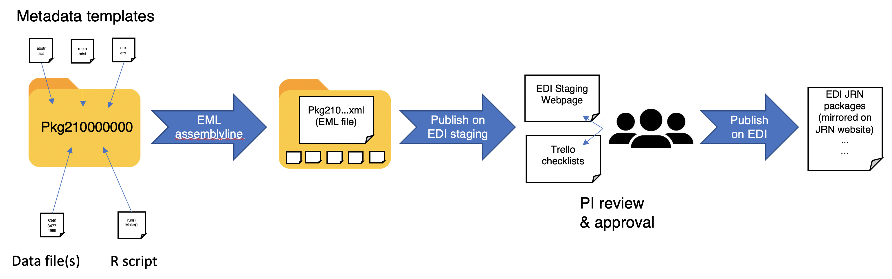
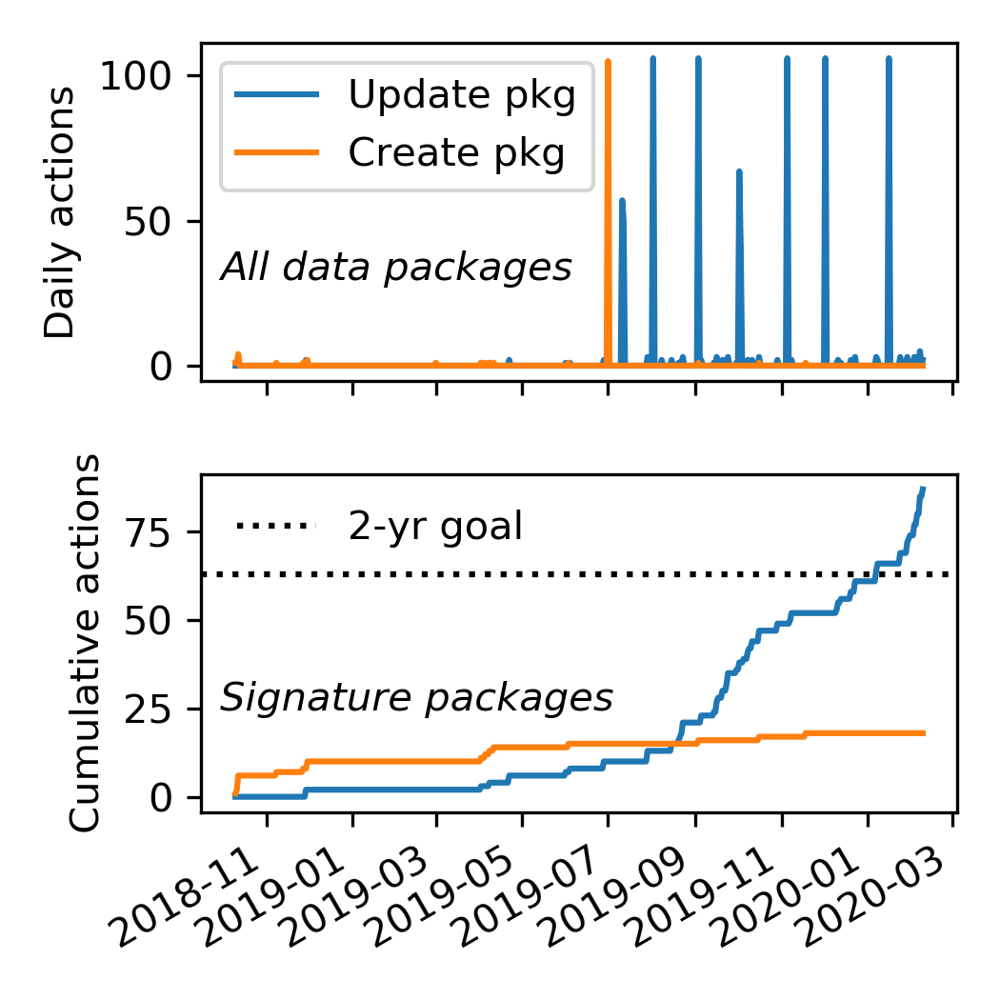

# Data Management Plan 

_Note: This data management plan is an update to the one in the 2020 JRN LTER-VII proposal._

## Introduction

The three core priorities of the Information Management (IM) system at the Jornada Basin LTER (JRN) are 

1. Contribute to high quality, impactful ecology research at all stages of the data life cycle
2. Oversee, or directly handle, publication of all Jornada datasets
3. Act as a source of data-related leadership and education

The IM team approaches each of these priorities with a philosophy of openness towards diverse stakeholders including scientists, managers, students, & the public, an a committment to the principles of open scientific research.

to support and enhance investigations and data collection, and to make data and other scientific products openly accessible to the science community, resource managers, policy makers, and the public. We are meeting these goals by addressing five IM priorities: (1) design and implement efficient systems to collect, quality-assure, document, and archive research data; (2) annotate research data with complete, standardized metadata; (3) timely publication of data and metadata in accepted research data repositories; (4) promote and facilitate discovery and re-use of JRN research data; and (5) advance sound data management and sharing practices at JRN through leadership and educational activities. The lead Information Manager and other staff use diverse technologies to advance these priorities and hold monthly meetings with JRN PIs to allow oversight of IM activities and promote the development of new goals and procedures.

Owing to IM deficiencies identified in the renewal proposal review, NSF granted JRN a probationary 2-year LTER award (instead of a full 6-year award) in 2018. A key concern was that JRN data packages were not routinely entered and updated in the Environmental Data Initiative's data repository (EDI). In response, we: (1) hired a new lead IM (Dr. Greg Maurer, started May 1, 2019), who regularly interacts with LTER Network IMs to learn about technologies, standards, and best-practices and then incorporates them into the JRN IM system; (2) focused our efforts over the past 18 months on writing and updating metadata and publishing new data to EDI, prioritizing our signature datasets (long-term, widely used in JRN or LTER network research); (3) developed the 5 IM priorities listed above; (4) created a new website data catalog that is directly synchronized with the JRN catalog at the EDI data repository; (5) updated our bibliography and personnel information and refreshed the look and feel of the JRN website; and (6) improved communication between the IM team and JRN scientists so they will be aware of, and compliant with, NSF, LTER Network, and JRN data policies. We anticipate that recent modifications to our personnel and practices, as described below, have greatly improved JRN data management and will restore our role as a leader in LTER IM in coming years.

## IM resources

__Personnel__: The JRN "IM team" is headed by G. Maurer. Supported at 1.0 FTE by JRN, Maurer brings a combination of ecological research experience and data management skills to the project. He leads a team comprised of a full-time computer programmer with machine learning expertise (Dr. Geovany Ramirez), a full-time project manager (Dr. Nina Joffe), full-time site manager John Anderson, and half-time database analyst Haneen Omari. The USDA contributions to the team include half-time statistician Darren James who assists Maurer and Omari with data quality assurance, metadata preparation, and EDI data package publication. Project manager Joffe is responsible for JRN website content and ensuring a smooth data publishing process for scientists, from study initiation to completion. USDA staff Scott Schrader and Ken Ramsey maintain servers, shared network resources, and the JRN website stack (Table 1). In addition, JRN scientists and staff contribute software tools for data analysis and visualization and share them as links or embedded apps on the JRN website.

__Computing and storage infrastructure__: The JRN IT infrastructure aims to provide diverse, secure, and resilient capabilities for storing and serving information needed by JRN personnel, external collaborators, and the public. The JRN LTER is housed in Wooton Hall, headquarters of the USDA-ARS Jornada Experimental Range (JER), on the New Mexico State University (NMSU) campus. A long-standing ARS-LTER agreement allows the JER to provide and manage most of the local computing infrastructure JRN requires (Table 1), including a cluster of 5 servers with a 100TB storage block. From this cluster, a virtual Ubuntu 16.04 server hosts the JRN website, and JRN staff are provided with CIFS shares for networked file storage. Most JRN research data, IM-related metadata and tools, and staff files and documents (e.g., images, equipment manuals, procedures documents) are also stored on these network shares. Other virtual servers on the same cluster provide additional resources used by JRN, including an R Shiny application server and a MySQL database being tested for research data storage. Hardware updates and upgrades are handled by USDA-ARS staff and NMSU's Information and Communication Technologies Office, with assistance from JRN as needed. All server and network share files are backed up on a 6-hour schedule, and full, system-wide, off-site tape backups occur monthly. Periodic technology transfers that update hardware, software, and file formats ensure long-term data protection against media or format obsolescence. The JRN IM team uses a variety of secure cloud platforms (e.g. _Trello_, _GitHub_, and _Zotero.org_) to store and manage documentation, bibliographies, and other project data. Off-site personnel that cannot use local network shares may store files in _Dropbox_ or _Google Drive_ depending on project needs and institutional requirements for project members.

**Local/remote resource** | **Software applications**  | **Implemented service**
:------------------ | :--------------------  | :-----------------------------------------------------------
Dell R710 server cluster | Citrix Xen Hypervisor | Miscellaneous virtual server hosting
Dell R710 server cluster | Ubuntu Linux 16.04, Apache HTTP Server, Drupal 7 | JRN website
zotero.org, server cluster | Zotero, Javascript, Drupal | Bibliography (on JRN website)
EDI, server cluster | Javascript, Drupal | Data catalog (on JRN website)
Local storage, server cluster | CIFS | Network file storage (documents, research data, metadata)
Dropbox, Google Drive | | Project document storage and sharing

Table 1: JRN computing resources, software, and implemented services used for Information Management.

__Network infrastructure__: Servers and staff computers are connected to a Gigabit local area network (LAN) linked to the NMSU network (Gigabit Ethernet) through a firewall. Local networked systems and web applications are password-protected, and regular security sweeps identify security threats. The USDA Jornada field headquarters (HQ; centrally located at the LTER research site) is linked to the NMSU network via a 40 MB multi-hop, point-to-point wireless backhaul connection for large-volume data (e.g., streaming meteorological and phenocam data). Field instruments are connected via 900 MHz spread spectrum wireless radios to base stations at HQ. This network allows communication with dataloggers and other research devices to be initiated from anywhere with internet access. Wireless internet at HQ is available for JRN LTER use.

## Elements of the JRN IM system

The JRN IM system consists of several interrelated components providing the critical functionality to create, manage, and distribute research data, metadata, and ancillary information. The lead IM maintains a public _GitHub_ organization (Jornada-IM) with repositories documenting the structure, standards, and procedures of the JRN IM system, and where the IM team develops data management software tools. The important components of the JRN IM system are described below with explanations of how they are accessible to the public. The JRN IM system integrates with all stages of the DataOne data life cycle, which are identified in parentheses in section headings below.

<figure>
  
  <figcaption><em>Figure 1: A simplified schematic of the JRN Information Management system. All activity and data occurring on local infrastructure (in yellow folders) is managed directly by the IM Team.</em></figcaption>
</figure>  

__Data collection and quality assurance (Collect, Assure)__: Research data generally enters the JRN IM system by one of four routes: (1) entry of long-term datasets manually collected by the 4-person JRN field crew, (2) autonomous data collection by sensor networks and dataloggers maintained by the JRN field crew, (3) data submission by LTER investigators and students, or (4) data submission by collaborators not directly managed by JRN. For data category (1), data are collected on a schedule that varies depending on the project, and the manager Anderson is responsible for archiving raw files, data entry/transcription, and production of quality controlled files suitable for publication. To optimize efficiency, custom applications (in _Excel_ and _MATLAB_) automate quality control at the time of data entry/transcription. For (2), we have adopted the _MATLAB GCE Toolbox_ (developed at GCE LTER) for data QA/QC and publishing, and we are extending its functionality with a human-assisted ML approach developed by Anderson and Ramirez. JRN also uses the USDA-developed DIMA database installed on field tablets, which permits data quality control at the time of collection. For data category (3), data collectors are required to submit quality-assured data and metadata to the IM team within a year of research project initiation, and annually thereafter for long-term research. This also applies to graduate students receiving the JRN LTER fellowship. The IM team communicates these requirements directly to PIs and students at JRN meetings and training events. Once data and metadata is submitted, the IM team archives and applies an additional layer of quality control with custom R scripts during the data publishing phase (Fig. 1). For data category (4), collaborators not directly involved with JRN, we provide access to data standards and archival storage upon request. For example, JRN LTER has been instrumental in developing data standards in the emerging Long-Term Agroecosystems Network (Spiegal et al. 2019).

__Data packaging and publishing (Describe, Preserve)__: A primary function of the JRN IM system is to create and distribute research data packages, consisting of quality-assured data and detailed metadata, to public, online data repositories (primarily EDI). There is considerable variety in data type (tabular, spatial, image, etc.), structure (variables, resolution, etc.), and source (long-term monitoring, JRN investigators, cross-site collaborators, etc.) among our data packages. All JRN data packages are therefore documented with detailed metadata by creating an XML metadata file formatted to the Ecological Metadata Language (EML) 2.2 schema. Data packages are then published to the EDI data repository through the Provenance Aware Synthesis Tracking Architecture system (_PASTA+_) whenever possible. Data packages held at EDI now constitute the de-facto JRN data catalog (Fig. 1), and the IM team is currently adding any missing and new packages to the repository. For data packages that are more logically archived in public repositories other than EDI (e.g, AmeriFlux), we publish a "metadata only" package at EDI with links to the outside data holding, **allowing discovery of all JRN data packages through one catalog**. We have published 117 new data packages to EDI since our 2018 panel review (the majority from our many meteorological stations), **a 124% increase over the prior 4 years, and we now publish streaming data from 15 weather stations on a monthly schedule** (Fig. 2).

<figure>
  
  <figcaption><em>Figure 2: A plot of JRN’s PASTA+ database activity (knb-lter-jrn scope), including package creation and recurring updates, at the EDI repository since the LTER-VII proposal review. Top panel: Daily actions for all packages (spikes = meteorological data package creation/updates). Bottom panel: Cumulative actions to signature data packages (new met packages excluded). The dashed line shows our goal to update our entire signature data inventory in the first 2 years of LTER-VII.</em></figcaption>
</figure>  

At the time of data package publication, the IM team error-checks data, outputs the data to an accepted format, and generates an EML file. Metadata in the EML file is populated according to LTER Network best practices, using the LTER Controlled Vocabulary and Standard Units Dictionary, and according to the JRN IM team's own metadata standards (documented and under development at the Jornada-IM _GitHub_ organization). The IM team consults with data providers during this process to ensure that complete, accurate, and high-quality metadata are obtained. EML creation is accomplished using custom R scripts that use the _EMLassemblyline_ and _EML_ packages for R (developed by EDI and rOpenSci, respectively). Upon upload of EML and associated data entities to EDI, the consistency and integrity of JRN data and metadata is checked by the _PASTA+_ system. Following upload, data and metadata files for all data packages are archived in a secure network share in the format suggested for the _EMLassemblyline_ package (Fig. 1).

__The JRN website (Plan, Discover)__: The JRN website (<https://lter.jornada.nmsu.edu>) is the central means of exposing our research, education, and outreach activities to JRN scientists and staff, external collaborators, and the public in an accessible and user-friendly way. It is a clearinghouse for JRN information and the gateway for discovery of and access to JRN data. Computing resources and software powering the website are described in Table 1, and are primarily maintained by USDA staff, under the supervision of the JRN IM team and PIs. Key elements of the JRN website are:

* _Site background and current research_: The combined research history at JRN LTER and USDA JER reaches back over a century (1915), and JRN has numerous ongoing long- and short-term research and monitoring projects. This complex scientific enterprise can be challenging to communicate to new personnel, collaborators, data users, and the public. For this reason, site descriptions, research vignettes, maps, instructions for new researchers, and other interpretive materials are made available on the JRN website. These materials are periodically revised and updated to reflect new research results and priorities, or other developments. 

* _Data catalog_: The JRN data catalog can be browsed and searched with the data catalog tool on the JRN website, which links directly to package landing pages on EDI. The website data catalog queries the EDI repository using the _PASTA+_ API, meaning search results from the website data catalog always reflect the current JRN holdings on EDI.

* _Personnel database_: The JRN personnel database is maintained on the website. Personnel records in the database store position and funding details, contact information, publication lists, and biographical details, and are updated twice yearly at a minimum. Cooperating staff and scientists in the co-located USDA-ARS Jornada Experimental Range and outside collaborators all have records in this database. 

* _Publication list_: The IM team manages a bibliography containing all JRN publications (including peer-reviewed journal articles, book chapters, reports, and theses) using _Zotero_. New publications are identified through reporting by PIs or the Site Research Manager, annual reports, and Google Scholar searches. The bibliography can be browsed and searched using a tool on the JRN website.

* _Synergistic activities and partnerships_: The JRN LTER participates in a number of education and outreach initiatives directly and through partnerships. Web pages about workshops and courses, applications and training materials, and cooperative agreements with management agencies or community groups are either hosted directly by or linked to the JRN website.

__Data access policies (Preserve, Discover)__: In adherence with the Type I data guidelines described in the LTER Network Access Policy, JRN publishes all research data no later than 2 years after collection or at the time of publication. At present, no Type II data are collected at JRN. Because the JRN LTER conducts research in areas (JER and the Chihuahuan Desert Rangeland Research Center) accessed by approved visitors, but occasionally also trespassers, detailed spatial location data for sensitive research sites are withheld from public metadata. Locations are available to researchers on request from the IM team. Most JRN data packages are published with the Creative Commons "CCBY" license. The JRN IM system ensures that all packages in the data catalog are publicly accessible in three locations: the JRN website data catalog, the EDI repository (in _PASTA+_), and the DataOne metadata aggregator through EDI's membership.

## Additional IM activities

__IM integration with research (Plan, Describe, Integrate, Analyze)__: The IM team works closely with JRN investigators, students, and collaborating scientists to ensure that their research meets data management standards and obligations. Members of the IM team consult with investigators in the early stages of research projects to design and initiate plans that ensure efficient, accurate, and complete collection of data and metadata. Upon publication, the IM team helps researchers format and revise metadata for addition to the JRN data catalog. The IM team maintains web pages in the Jornada-IM _GitHub_ organization, targeted at JRN researchers, that distribute instructional materials, metadata templates, documentation of the JRN IM system (including this document), and offer tutorials on JRN data access and citation.

Members of the IM team participate in JRN research as scientists in several capacities. The lead IM is a member of the JRN Data Science team, which is developing capabilities for the proposed Data Science Integration System (DSIS) system to synthesize and harmonize datasets from different studies and locations across the Jornada Basin. The IM team works directly with investigators in the analysis and interpretation of JRN research data and contributes to JRN publications. The lead IM has latitude to collaborate with LTER Network IMs and scientists in the conception, writing, and publishing of articles in ecological informatics and cross-site synthesis.

__Education and outreach__: The lead IM strives to make sound data management a highly visible priority within the JRN LTER community, and makes every effort to provide data management services, resources, and education to our students, researchers, collaborators, and partners. The JRN IM team endeavors to raise the data literacy of these groups with several events each year. We give data management presentations and organize "metadata parties" at JRN events, such as the _Jornada Desert Ecology Short Course_, and at invited opportunities with JRN-affiliated lab and student groups at NMSU and the University of Texas-El Paso. A new "_Data Bounty Hunters_" program will begin in 2020. Instructional materials on metadata, JRN data access, and data citation are being written to complement all these events. The IM team communicates regularly with investigators and graduate students to track research progress, request data and metadata submission, and raise awareness of current and developing LTER Network data management practices and expectations. The co-located USDA-ARS Jornada Experimental Range supports several applied science and informatics projects (Landscape Data Commons, for example) where future collaborations will enable shared development of informatics tools, best practices, and educational curricula of interest to JRN and the LTER Network. Finally, the IM Team is planning new initiatives with JRN's outreach partners, including the _Asombro Institute for Science Education_. These include archiving student research data and contributing to development of data literacy curricula for primary and secondary school students and teachers.

__Network participation__: Lead IM Maurer actively contributes to the LTER Network's IM activities in several capacities. Presently, he participates in the LTER IM "Non-tabular data" working group developing best practices for publishing data packages with non-standard data types, including UAV image and hyperspectral data, photographic datasets, ecological models, and genomic data. Maurer has recently begun working with EDI software developers with the goal of contributing bug fixes and improvements to the _EMLassemblyline_ R package. The JRN IM team also participates in a southwest U.S. regional group of LTER sites (JRN, SEV, CAP, and MCM) with nascent plans for regional data management workshops and informatics initiatives slated to begin in August 2020. Future JRN IM work will be presented at conferences, training sessions, the annual IMC meeting, and in peer-reviewed journal articles. The expanded _GCE Toolbox_ using machine learning to QA/QC streaming met station data will be made available to other sites in the near future.

## Recent accomplishments and future initiatives

__Milestones in the current funding cycle__: Since the probationary LTER award in 2018, JRN has focused its efforts on developing new IM practices compliant with NSF and LTER standards, and on updating the JRN data catalog. Milestones we have reached in the past 18 months include:

1. Development of new data and metadata content and formatting standards for all JRN data packages.
2. Prioritization of JRN data packages for publication to EDI based on three classes: long-term signature, long-term, and short-term.
3. Updated metadata and data (to 2019) for all of JRN's long-term signature packages on EDI, and ensured they are consistent with our newly developed standards.
4. Released a major revision of our website with updates to interpretive material, the data catalog, and the JRN bibliography.

__Future initiatives__: The JRN IM system has become more robust and effective over the past 18 months, approaching our goal that information management at JRN must meet or exceed all LTER Network standards and expectations. In addition to implementing the planned data literacy education and outreach initiatives outlined earlier, the lead IM is working to identify further improvements to the IM system itself. Planned improvements during the next phase of LTER-VII include:

1. Integration of research and data management forms and tracking with the JRN website.
2. Updating data and metadata in completed, short-term, student, and other non-signature data packages that currently have lower priority in the JRN data catalog.
3. Development of a new metadata database using the _LTER-core-metabase_ schema currently being developed by LTER IMs.
4. Creation of new workflows and data management tools to assist in the analysis and publication of our growing catalog of ecological imagery data from UAVs, phenocams, and other platforms.
5. Continued development of the data management and analysis capabilities needed for DSIS, including aggregating and harmonizing suites of ecological data, further enhancement and standardization of project metadata, databasing of tabular research data, and development of analytical applications using open-source tools like R and Python.

