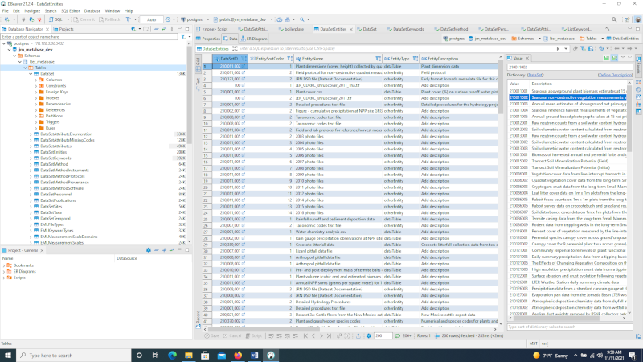

RESOURCES FOR UPDATING DATASETS IN THE METABASE:
------------------------------------------------

*The following are resources that can be referred to for information
needed in order to enter or update datasets.*

[**Data Catalog**:]{.underline}
[[https://lter.jornada.nmsu.edu/data-catalog]{.underline}](https://lter.jornada.nmsu.edu/data-catalog)

-   Shows you the Jornada Data Catalog that will link to the EDI portal.
    > You can explore any of the data packages that are already on the
    > website.

[**EDI Data Portal**:]{.underline}
[[https://portal.edirepository.org/nis/home.jsp]{.underline}](https://portal.edirepository.org/nis/home.jsp)

-   This is where you can see what needs updating or to double check
    > that your metadata has been published properly.

    -   **Home**

    -   **Data** scroll to → **Package Identifier** which leads you to
        > scopes. Click on *knb-lter-jrn*, then choose a project ID

        -   Scroll down to **Package ID** to see previous or all
            > revisions.

        -   **Resources** will list the datasets attached and let you
            > "View Full Metadata"

            -   Full Metadata will show you detailed info of the dataset
                > we entered on EDI through DBeaver

**[Trello:]{.underline}** (used to track the datasets and to see which
need updating)

-   There are Trello boards for NonCore and Core data packages, click on
    > whichever applies.

-   Find lists of datasets to work on:

    -   To Do - work that still needs to be done

    -   In Progress/Staged - if we are currently working on it

    -   In PI review - waiting for PI's, not ready to publish yet

    -   Published to EDI

**Download DBeaver** - cloud server with several databases, used by the
IM team to make edits. This process will only need to be done once.

-   Open (Plug+) in top left corner then select the PostgreSQL (with the
    > elephant)

    -   **Host**: 178.128.3.36

    -   **Database**: jrn\_metabase\_dev

    -   **Username**: i.e. jdoe

**Password**: lter1234 (until you change the password elsewhere)

**Navigating the JORNADA\_IM server:**

Open NonCore\_packages 🡪 find your data set ID of interest: (i.e.,
210370001\_grasshopperdata) 🡪

-   Find EML file: knb-lter-jrn.210370001.28.xml

> {width="3.6875in"
> height="3.0416666666666665in"}

-   Find abstract: abstract.210370001.md.

> {width="4.126619641294838in"
> height="3.1718755468066493in"}

-   Find any dataset tables, i.e. substrate data, vegetation data,
    > species codes, etc: JRN370002\_grasshoppervegdata.csv,
    > JRN370002\_speciescodes.txt,
    > JRN\_370001\_grasshopper\_visual\_sampling\_data.csv,
    > JRN\_370001\_grasshopper\_substrate\_data.csv

**Other resources for data:**

{width="6.005208880139983in"
height="5.348724846894139in"}

NAVIGATING THE DBEAVER DATABASE TO UPDATE AND INCORPORATE DATASETS:
-------------------------------------------------------------------

*The following are instructions for navigating through the DBeaver
database in order to enter in or update datasets using the resources
outlined above.*

### [DBeaver:]{.underline} 

-   Click (on left-hand side) to drop-down each of the following:

    -   ***\>postgres***

    -   ***\>jrn\_metabase\_dev***

    -   ***\>Schemas***

    -   ***\>lter\_metabase***

    -   ***\>Tables***: (This is where the metadata is stored and where
        > most of the edits are made)

{width="3.125in"
height="1.6354166666666667in"}

-   \>**DataSet**: enter "DataSetID"= 210370001 into search engine and
    > Enter

    -   If no results: Add new row by clicking
        > {width="0.15625in"
        > height="0.15625in"} icon at the bottom or highlight a row and
        > click on "Duplicate current row"

    -   Update the following fields, if applicable:

        -   **DataSetID:** i.e., 210370001

        -   **Title:** enter full title of the project, i.e.,
            > Grasshopper survey and substrate utilization data at the
            > Jornada Basin LTER site, 1983 to 1985

        -   **PubDate:** date that it's being published: 2021-11-16
            > (usually today's date)

        -   **Abstract:** file name referenced from respective dataset
            > folder on the Shared Drive i.e. abstact.210370001.md

        -   **ShortName:** i.e., TRANFALL (use name from file on
            > Jornada\_IM server or from "project" tab in
            > jornada-prj-sheets on Google Drive)

        -   **UpdateFrequency:** options are notPlanned (if project is
            > complete), annually, biannually, or asNeeded (if project
            > is ongoing)

        -   **MaintenanceDescription:** options are complete, ongoing,
            > or \[NULL\]

        -   **AbstractType:** file

        -   **BoilerplateSetting:**
            > jrn-default{width="6.249405074365704in"
            > height="1.734375546806649in"}

        -   Save by clicking
            > "{width="0.15207020997375328in"
            > height="0.15228127734033245in"} Save" button at the
            > bottom.

-   \>**DataSetAttributes**: enter "DataSetID"= 210370001 into search
    > engine and Enter

    -   If \>DataSetEntities has an **EntityType** dataTable, then
        > proceed with the following.

    -   If no results: Add new row by clicking
        > {width="0.15625in"
        > height="0.15625in"} icon at the bottom or highlight a row and
        > click on "Duplicate current row"

    -   To enter multiple rows, right click 🡪 Advanced Paste ... 🡪
        > Insert multiple rows

    -   Reference the data sets found on JORNADA\_IM server. These are
        > also the files entered in \>DataSetEntities:

        -   **DataSetID**: 210370001

        -   **EntitySortOrder**: i.e. 1 for all within the same dataset,
            > 2 for all within the next dataset, etc.

        -   **ColumnPosition**: i.e. 1, 2, 3, 4...etc. for each row

        -   **ColumnName**: reference the data located in the metadata
            > template or data file. i.e., (jgrashop.dsd) Date, Plot,
            > Transect, Quadrat, Species, Mean\_Diameter, Mean\_Height,
            > Total\_Number

        -   **AttributeID**: i.e. Date, Plot, Transect, Quadrat,
            > Species, Mean\_Diameter, Mean\_Height, Total\_Number
            > **Repeat whatever is in ColumnName?**

        -   **AttributeLabel**: i.e. Date, Plot, Transect, Quadrat,
            > Species, Mean\_Diameter, Mean\_Height, Total\_Number
            > **Repeat whatever is in ColumnName?**

        -   **Description**: i.e., Date, Plot number \[10-18\], Transect
            > number \[1-2\], Quadrat number \[1-20\], Species code
            > \[see JornadaGrasshopperDatasetCodes.txt\], Mean plant
            > diameter \[cm\], Mean plant height \[cm\], Total number of
            > individuals per square meter per quadrat

        -   **Storage Type**: i.e., Date = date; plot, quadrat, transect
            > number, or total number = integer; mean diameter or height
            > = float; species code = string

        -   **MeasurementScaleDomainID**: Date = dateTime; integer =
            > interval; float = ratio; string = nominalText

        -   **DateTimeFormatString**: ONLY on rows with column name
            > "date", all others should be \[NULL\]. Always YYYY/MM/DD
            > format.

        -   **DateTimePrecision**: 1 on rows filled out as above, all
            > others should be \[NULL\].

        -   **TextPatternDefinition**: any nominal text doesn't need a
            > unit and can be added to that row as "any text". All
            > others should be \[NULL\].

        -   **Unit**: "number" for intervals or "centimeter" for ratios.
            > Date and nominal text should be \[NULL\].

        -   **NumberType**: "integer" for intervals or "real" for
            > ratios. Date and nominal text should be \[NULL\].

    -   Repeat for each file in the server.

    -   If a certain unit can't be found, it must be added to the EML
        > unit dictionary.

    -   Based on the R script console, any column with NA values
        > requires a line entry. If it is missing info, such as NA, in
        > the dataset, it will require an NA1 value (check define
        > description).

    -   Save by clicking
        > "{width="0.15207020997375328in"
        > height="0.15228127734033245in"} Save" button at the
        > bottom.{width="5.671875546806649in"
        > height="3.4432174103237094in"}

-   \>**DataSetEntities** (to associate/attach files): enter
    > "DataSetID"= 210370001 into search engine and Enter

    -   The files (.pdf, .TIF, csv) found in Jornada\_IM server, under
        > the file name i.e. 21037001\_GrasshopperData, are used to
        > update the following columns, if applicable:

        -   **EntitySortOrder**: change to subsequent number i.e. 2, 3,
            > 4

        -   **EntityName**: change to something short but descriptive:
            > Plant and grasshopper species codes

        -   **EntityType**: to dataTable (if dataTable, add
            > DataSetAttributes) or otherEntity

        -   **EntityDescription**: something longer, uniform, and more
            > descriptive: Numerical and species codes for plants and
            > grasshoppers

        -   **FileType**: usually csv\_B (most files) or plaintext

        -   **Urlhead**:
            > https://sfo3.digitaloceanspaces.com/jrn-pubfiles/

        -   **File Name**: enter exact file name:
            > JRN\_37001\_grasshopper\_substrate\_data.csv

        -   **FileSizeUnits:** byte

    -   For each data set, highlight row and click on
        > {width="0.13541666666666666in"
        > height="0.13541666666666666in"} icon at the bottom to
        > "Duplicate current row". Then update columns as above.

    -   Save by clicking
        > "{width="0.15207020997375328in"
        > height="0.15228127734033245in"} Save" button at the bottom.

{width="5.479166666666667in"
height="3.0819444444444444in"}

-   \>**DataSetKeywords**: enter "DataSetID"= 210370001 into search
    > engine and Enter

    -   If no results: Add new row, multiple rows, or duplicate rows as
        > instructed above.

    -   Update columns as follows:

        -   **DataSetID**: i.e., 210370001

        -   **Keyword**: enter one word per row that has to do with the
            > project i.e., grasshoppers, vegetation, abundance, etc...
            > Use metadata template in file folder on Jornada\_IM
            > server.

            -   Always use study number i.e., study 370. This is done by
                > adding it to ListKeywords. Any keywords that do not
                > exist yet, can be added in ListKeywords.

        -   **ThesaurusID**: lter\_cv or jornada\_placenames if it is a
            > location/place. If it is the study ID i.e., study 370 -
            > then ThesaurusID should be jornada\_projectnames

    -   {width="0.15207020997375328in"
        > height="0.15228127734033245in"} Save

-   \>**DataSetMethod**: enter "DataSetID"= 210370001 into search engine
    > and Enter

    -   If no results: Add new row or duplicate row as instructed above.

    -   Update columns as follows:

        -   **DataSetID**: i.e., 210370001

        -   **MethodStepID**: 1

        -   **DescriptionType:** file

        -   **Description:** methods.210370001.md

        -   **Method\_xml**: \[NULL\]

    -   Create method and abstract markdown files.

        -   Make sure method and abstract is in R file.

-   \>**DataSetPersonnel**: enter "DataSetID"= 210370001 into search
    > engine and Enter

    -   If no results: Add new row, multiple rows, or duplicate rows as
        > instructed above.

        -   Enter each row with the name of people involved i.e.,
            > dpeters

    -   Update columns as follows:

        -   **DataSetID**: i.e., 210370001

        -   **NameID:** Select cell and type name into Value box on
            > right-hand side..... i.e., dlightfoot, wwhitford. When the
            > name appears in the Dictionary section, click to populate
            > it into the NameID field. Repeat for each name. If you
            > don't see the NameID of the person you are looking for pop
            > up on the right-hand side, you will need to add their
            > names under ListPeople

    -   {width="5.182292213473316in"
        > height="1.4975448381452319in"}

        -   **AuthorshipOrder:** 1, 2, 3...

        -   **AuthorshipRole**: i.e., creator, contact

    -   {width="0.15207020997375328in"
        > height="0.15228127734033245in"} Save

-   \>**DataSetPublications**:

    -   If applicable, update columns as follows:

        -   **DataSetID**: i.e., 210370001

        -   **RelationshipType:** usageCitation or literatureCited

-   \>**DataSetSites**: enter "DataSetID"= 210370001 into search engine
    > and Enter

    -   If no results: Add new row, multiple rows, or duplicate rows as
        > instructed above.

    -   Update columns as follows:

        -   **DataSetID:** i.e., 210370001

        -   **EntitySortOrder:** 0

        -   **SiteID:** i.e., Bajada\_West, Basin\_Floor,
            > JER\_CDRRC\_bounding (general use)

        -   **GeoCoverageSortOrder:** 1, 2

    -   {width="0.15207020997375328in"
        > height="0.15228127734033245in"} Save

-   \>**DataSetTaxa**: This is where you can link taxonomic data to a
    > dataset.

    -   Update columns as follows:

        -   **DataSetID:** i.e., 210XXXXXX

        -   **TaxonID:** enter the ITIS number you obtained from
            > ITIS.gov in the \>**ListTaxa** section.

        -   **TaxonomicProviderID:** i.e., itis

    -   {width="0.15207020997375328in"
        > height="0.15228127734033245in"} Save

-   \>**DataSetTemporal**: enter "DataSetID"= 210370001 into search
    > engine and Enter

    -   If no results: Add new row, multiple rows, or duplicate rows as
        > instructed above.

    -   Update columns as follows:

        -   **DataSetID:** i.e., 210370001

        -   **EntitySortOrder:** 0

        -   **BeginDate** and **EndDate:** (make sure it's in proper
            > YYYY/MM/DD format)

            -   This can be found on the Google share drive, in the
                > jornada-prj-sheets spreadsheet, under the Project tab.

        -   **UseOnlyYear:** \[ \] uncheck if updated dates include
            > month/day

-   \>**ListKeywords**: If there are keywords to add in DataSetKeywords
    > that are not found, they can be added here. Include any key words
    > that should be associated with the project.

    -   Control F to double check that the word doesn't already exist.
        > If it doesn't, add it as follows

    -   Add row and include:

        -   **Keyword**: Study 370,

        -   **ThesaurusID**: jornada\_projectnames

        -   **KeywordType**: theme

    -   Include any other relevant keywords that weren't found when
        > searching in DataSetKeywords. Other examples include:

        -   **Keyword**: creosotebush; Chihuahuan Desert

        -   **ThesaurusID**: (look on
            > [[https://vocab.lternet.edu/vocab/vocab/index.php]{.underline}](https://vocab.lternet.edu/vocab/vocab/index.php)
            > for word, if it's there enter as lter\_cv; if not enter as
            > none. If it's a place, such as site, etc.,
            > jornada\_placenames

        -   **KeywordType**: theme; place

    -   

    -   {width="0.15207020997375328in"
        > height="0.15228127734033245in"} Save

-   \>**ListPeople**: To update the creators involved with a project.

    -   Duplicate a current row in order to add people. If it has new
        > personnel, then

    -   To delete a row, highlight row and click "Delete Current Row" at
        > the bottom. It will highlight red so you must Save in order to
        > save changes.

-   \>**ListPublications** (to attach publications with data sets):

    -   Update columns as follows:

        -   **PublicationID:** i.e.,

        -   **Bibtex:**

-   \>**ListTaxa**: This is where you can enter taxonomic data. First go
    > to ITIS.gov to search for the ITIS Taxa ID if species is not
    > already listed in this section.

    -   Update columns as follows:

        -   **TaxonID:** enter the ITIS number you obtained from
            > ITIS.gov

        -   **TaxonomicProviderID:** itis

        -   **TaxonRankName:** species

        -   **TaxonRankValue:** Genus species name i.e., Bos taurus

        -   **CommonName:** i.e., domesticated cattle

        -   **LocalID:** ID found through ITIS.gov i.e., cow or BOER4

    -   {width="0.15207020997375328in"
        > height="0.15228127734033245in"} Save
